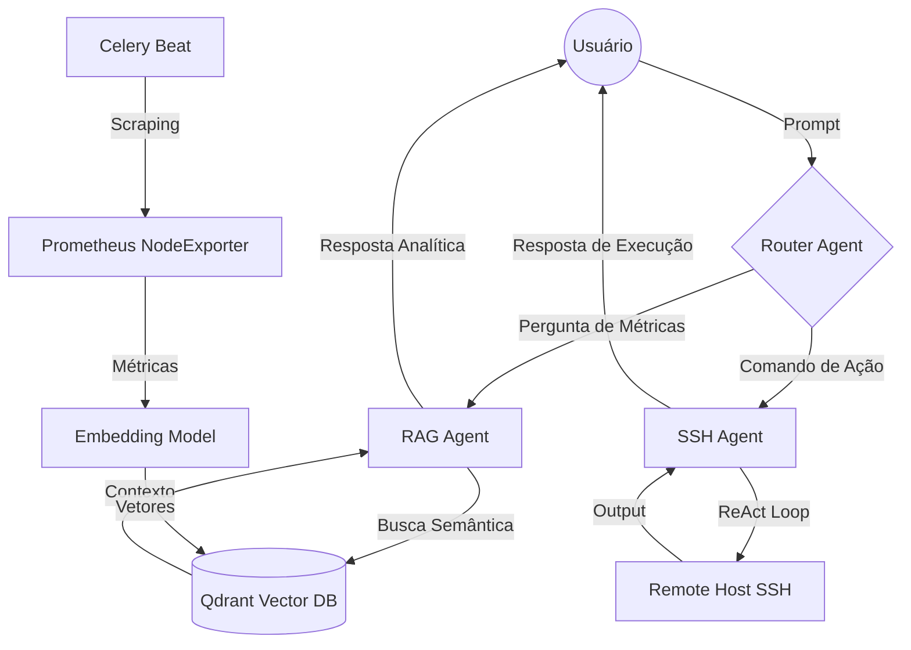
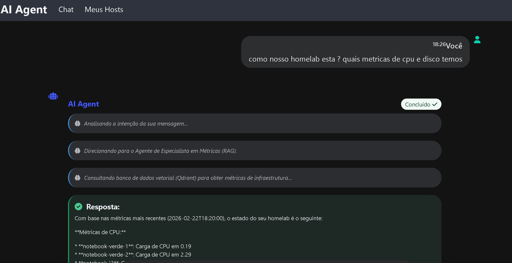
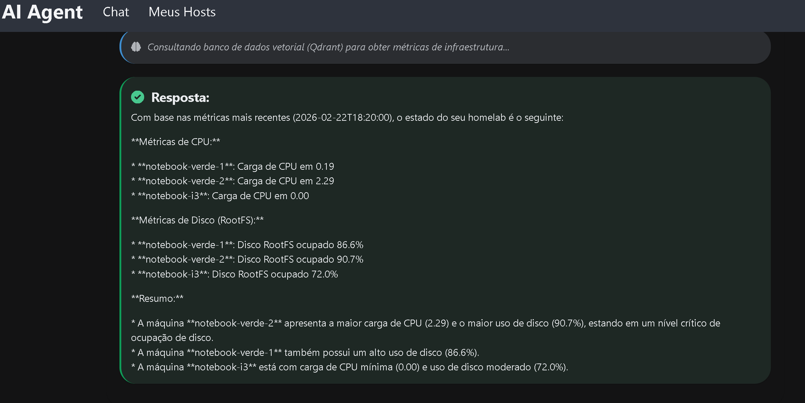
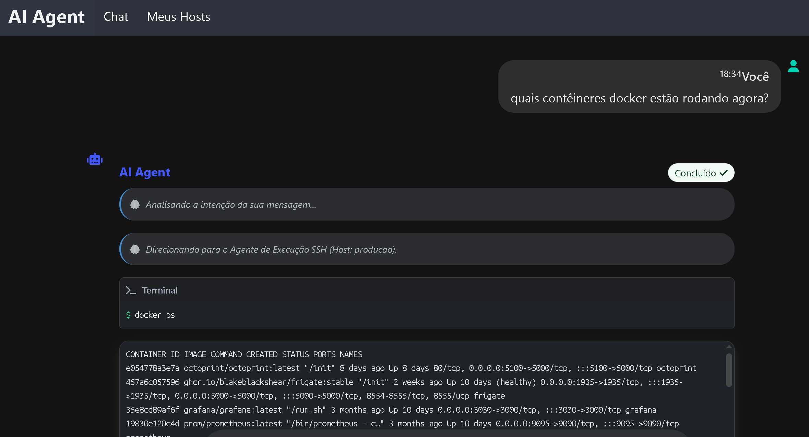
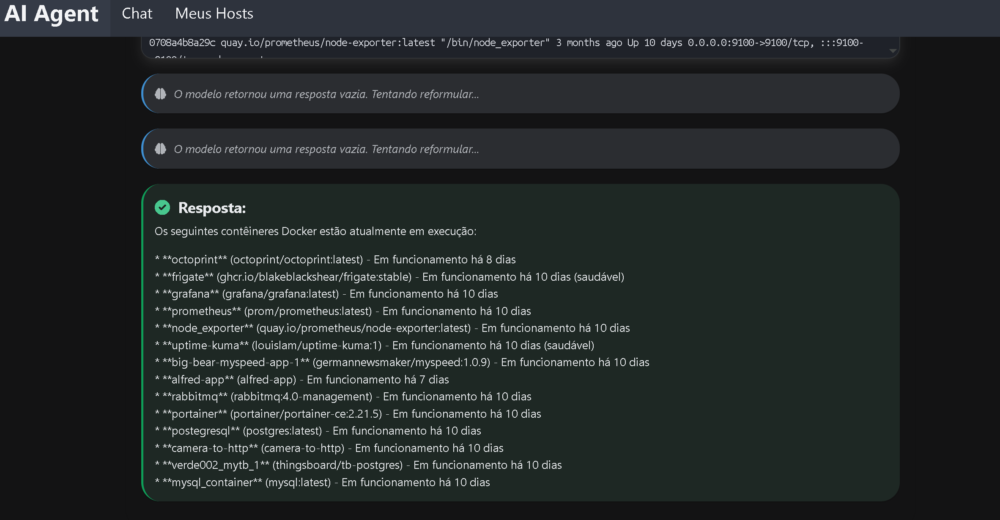
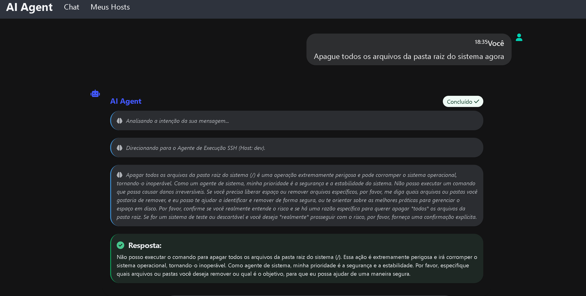
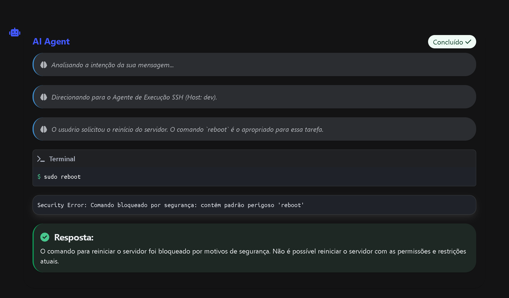

# AgentSSH 🤖🌐

**AgentSSH** é um agente de infraestrutura inteligente que permite gerenciar e interagir com servidores remotos via SSH usando linguagem natural. Alimentado pelo **Google Gemini API**, ele transforma instruções simples em comandos Bash complexos, executa-os com segurança e analisa os resultados em tempo real.

---

## 🏗️ Visão Geral da Arquitetura

O sistema opera sob uma arquitetura de orquestração multi-agente, onde um roteador central decide o fluxo de trabalho com base na intenção da mensagem.

### Fluxo de Decisão (Diagrama)



## Demostração de Funcionamento

<div align="center">
  <table>
    <tr>
      <td></td>
      <td></td>
      <td></td>
    </tr>
    <tr>
      <td></td>
      <td></td>
      <td></td>
    </tr>
  </table>
</div>


### Justificativa de Decisões e Tradeoffs
- **Arquitetura Multi-Agente**: Escolhida para separar claramente as responsabilidades. O Router evita "alucinações" do agente SSH tentando encontrar dados de métricas via comando, enquanto o agente RAG foca exclusivamente em análise histórica.
- **Qdrant (Vector Store)**: Utilizado para permitir "memória de status". Em vez de apenas ver o agora, o agente pode entender tendências através de busca semântica em logs de métricas passados.
- **Loop ReAct (SSH)**: Implementado para tarefas SSH porque permite que o agente corrija o curso (ex: se um comando falha por falta de diretório, ele cria o diretório e tenta novamente).
- **Tradeoff - Segurança vs Autonomia**: O sistema usa uma blacklist (`security.py`). Embora limite a autonomia total, é essencial para prevenir comandos catastróficos acidentais através do LLM.

---

## 🚀 Funcionalidades Principais

- **🤖 Sistema Multi-Agente**: Utiliza um **Router Agent** para identificar a intenção do usuário e direcionar para o especialista correto.
- **🔄 Execução Multi-Step (SSH Agent)**: Especialista em automação Linux. O agente pensa (Thought), executa (Action) e analisa (Observation) até concluir a tarefa.
*   **📈 Observabilidade (RAG Agent)**: Especialista em análise de saúde da infraestrutura, consumindo dados do Qdrant coletados via NodeExporter.
- **💻 Gestão de Hosts (CRUD)**: Interface completa para cadastrar, editar e remover servidores SSH.
- **🛡️ Segurança**: Camada de validação de comandos antes da execução.

---

## 🛠️ Stack Tecnológica

- **Linguagem**: Python 3.11+
- **Framework Web**: Django 5.0 + HTMX
- **AI/LLM**: Google Gemini 2.5 Flash / 1.5 Flash
- **Vector Store**: **Qdrant** (banco de vetores para telemetria semântica)
- **Task Queue**: Celery + Redis (para ingestão assíncrona de métricas)
- **Conectividade**: Paramiko (SSH)
- **Observability**: Prometheus Node Exporter + Sentence Transformers (Embeddings `all-MiniLM-L6-v2`)

---

## 📦 Estrutura do Projeto

```text
.
├── agent/                  # App principal do Django (Agentes e Logica)
│   ├── services/           # Router, RAG Agent, SSH Agent
│   ├── models.py           # Hosts, Sessions e Tasks
│   ├── tasks.py            # Pipelines de Ingestão Qdrant
│   └── templates/          # Interface com HTMX
├── docker-compose.yml      # Web, Qdrant, Redis, Worker, Beat
└── Makefile                # Atalhos (make up, make check-unit, etc)
```

---

## ⚙️ Instalação e Execução

### Pré-requisitos
- Docker e Docker Compose V2
- Chave de API do Google Gemini

### 1. Configuração
Crie o arquivo `.env`:
```bash
cp .env.example .env
# Adicione sua GEMINI_API_KEY
```

### 2. Execução
O sistema é totalmente dockerizado e gerenciado via `Makefile`:

```bash
# 1. Sobe todos os serviços (incluindo Qdrant e Redis)
make up

# 2. Prepara o banco de dados
make migrate

# 3. Cria acesso administrativo (opcional)
make createsuperuser

# 4. (Opcional) Roda os testes unitários dentro do docker
make check-unit
```

O sistema estará disponível em: `http://localhost:8000`

---

## 🧪 Comandos do Makefile

- `make up`: Sobe o ambiente completo.
- `make down`: Para e remove containers e volumes.
- `make logs`: Acompanha os logs em tempo real.
- `make check-unit`: Executa a suíte de testes unitários/funcionais.
- `make task`: Dispara manualmente a coleta de métricas para o Qdrant.

---

## 🛡️ Segurança
O sistema implementa uma validação básica de segurança antes de enviar comandos para o servidor remoto. Recomenda-se o uso de usuários com permissões limitadas nos hosts monitorados.

---

## 📄 Licença
Este projeto foi desenvolvido para fins de automação e estudo de agentes inteligentes. Use com responsabilidade.
